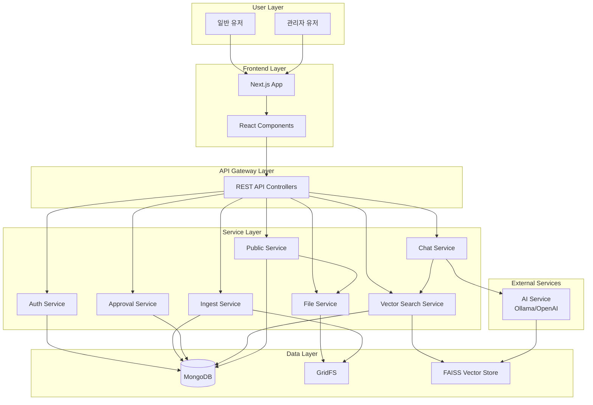

# MDM 시스템 아키텍처 다이어그램

## 통합 시스템 아키텍처 다이어그램 (서비스별)



## 전체 시스템 구조

```
┌─────────────────┐    ┌─────────────────┐    ┌─────────────────┐
│   Frontend      │    │    Backend      │    │   Database      │
│   (Next.js)     │◄──►│  (Spring Boot)  │◄──►│   (MongoDB)     │
│   Port: 3000    │    │   Port: 8080    │    │   Port: 27017   │
└─────────────────┘    └─────────────────┘    └─────────────────┘
```

## 기술 스택

### 백엔드
- **Framework**: Spring Boot 3.2
- **Language**: Java 17
- **Database**: MongoDB 7.0
- **Authentication**: JWT
- **Documentation**: OpenAPI 3.0 (Swagger)
- **Build Tool**: Gradle

### 프론트엔드
- **Framework**: Next.js 14
- **Language**: TypeScript
- **UI Library**: React 18
- **Styling**: Tailwind CSS
- **HTTP Client**: Axios
- **Build Tool**: npm

### 인프라
- **Containerization**: Docker & Docker Compose
- **Reverse Proxy**: Nginx (개발 환경)
- **File Storage**: GridFS (MongoDB)


