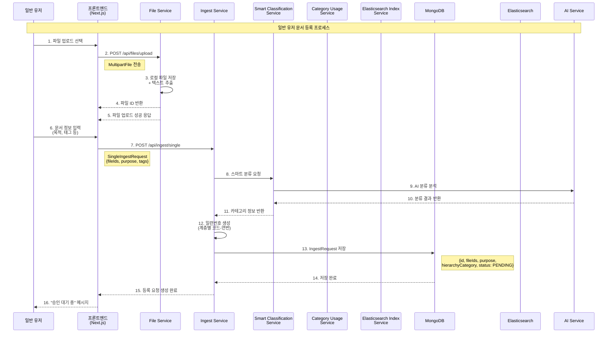
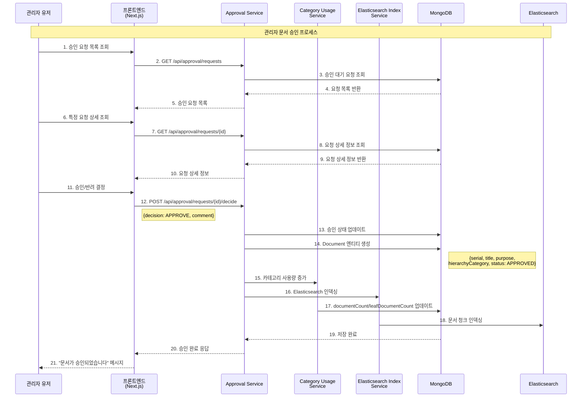

# 문서 등록 시퀀스 다이어그램

## 일반 유저 - 문서 등록 시퀀스 다이어그램

```mermaid
sequenceDiagram
    participant U as 일반 유저
    participant F as 프론트엔드<br/>(Next.js)
    participant FS as File Service
    participant IS as Ingest Service
    participant SCS as Smart Classification<br/>Service
    participant CUS as Category Usage<br/>Service
    participant EIS as Elasticsearch Index<br/>Service
    participant M as MongoDB
    participant E as Elasticsearch
    participant AI as AI Service

    Note over U,AI: 일반 유저 문서 등록 프로세스

    U->>F: 1. 파일 업로드 선택
    F->>FS: 2. POST /api/files/upload
    Note right of F: MultipartFile 전송
    FS->>FS: 3. 로컬 파일 저장<br/>+ 텍스트 추출
    FS-->>F: 4. 파일 ID 반환
    FS-->>F: 5. 파일 업로드 성공 응답

    U->>F: 6. 문서 정보 입력<br/>(목적, 태그 등)
    F->>IS: 7. POST /api/ingest/single
    Note right of F: SingleIngestRequest<br/>{fileIds, purpose, tags}
    
    IS->>SCS: 8. 스마트 분류 요청
    SCS->>AI: 9. AI 분류 분석
    AI-->>SCS: 10. 분류 결과 반환
    SCS-->>IS: 11. 카테고리 정보 반환
    
    IS->>IS: 12. 일련번호 생성<br/>(계층별 코드-연번)
    IS->>M: 13. IngestRequest 저장
    Note right of M: {id, fileIds, purpose,<br/>hierarchyCategory, status: PENDING}
    M-->>IS: 14. 저장 완료

    IS-->>F: 15. 등록 요청 생성 완료
    F-->>U: 16. "승인 대기 중" 메시지
```

## 관리자 유저 - 문서 승인 시퀀스 다이어그램

```mermaid
sequenceDiagram
    participant A as 관리자 유저
    participant F as 프론트엔드<br/>(Next.js)
    participant AS as Approval Service
    participant CUS as Category Usage<br/>Service
    participant EIS as Elasticsearch Index<br/>Service
    participant M as MongoDB
    participant E as Elasticsearch

    Note over A,E: 관리자 문서 승인 프로세스

    A->>F: 1. 승인 요청 목록 조회
    F->>AS: 2. GET /api/approval/requests
    AS->>M: 3. 승인 대기 요청 조회
    M-->>AS: 4. 요청 목록 반환
    AS-->>F: 5. 승인 요청 목록

    A->>F: 6. 특정 요청 상세 조회
    F->>AS: 7. GET /api/approval/requests/{id}
    AS->>M: 8. 요청 상세 정보 조회
    M-->>AS: 9. 요청 상세 정보 반환
    AS-->>F: 10. 요청 상세 정보

    A->>F: 11. 승인/반려 결정
    F->>AS: 12. POST /api/approval/requests/{id}/decide
    Note right of F: {decision: APPROVE, comment}
    
    AS->>M: 13. 승인 상태 업데이트
    AS->>M: 14. Document 엔티티 생성
    Note right of M: {serial, title, purpose,<br/>hierarchyCategory, status: APPROVED}
    AS->>CUS: 15. 카테고리 사용량 증가
    AS->>EIS: 16. Elasticsearch 인덱싱
    CUS->>M: 17. documentCount/leafDocumentCount 업데이트
    EIS->>E: 18. 문서 청크 인덱싱
    M-->>AS: 19. 저장 완료

    AS-->>F: 20. 승인 완료 응답
    F-->>A: 21. "문서가 승인되었습니다" 메시지
```

