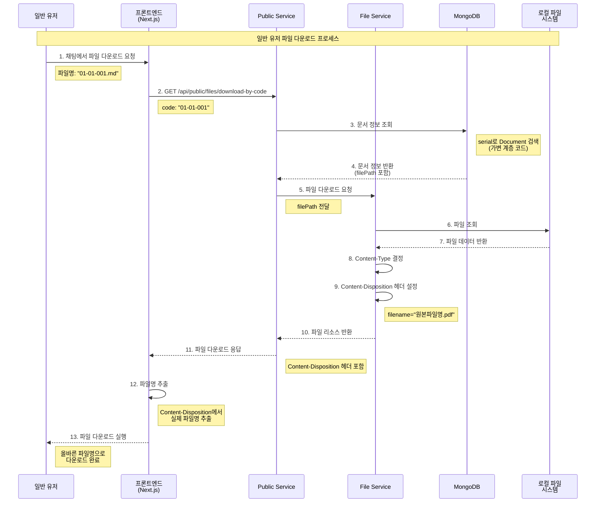
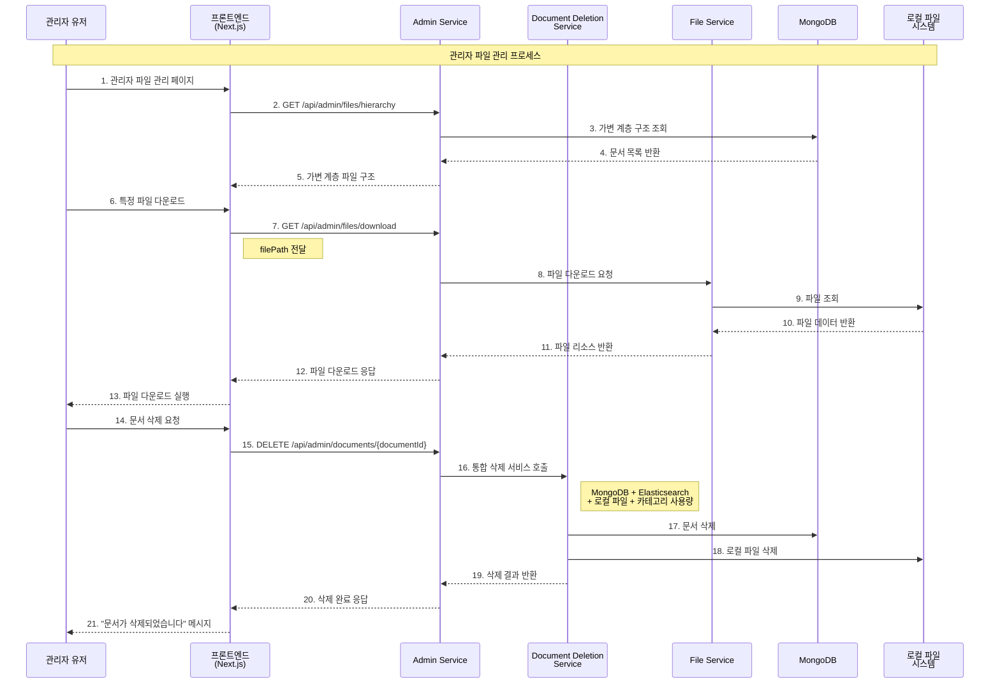

# 파일 다운로드 시퀀스 다이어그램

## 일반 유저 - 파일 다운로드 시퀀스 다이어그램

```mermaid
sequenceDiagram
    participant U as 일반 유저
    participant F as 프론트엔드<br/>(Next.js)
    participant PS as Public Service
    participant FS as File Service
    participant M as MongoDB
    participant LocalFS as 로컬 파일<br/>시스템

    Note over U,LocalFS: 일반 유저 파일 다운로드 프로세스

    U->>F: 1. 채팅에서 파일 다운로드 요청
    Note right of U: 파일명: "01-01-001.md"
    F->>PS: 2. GET /api/public/files/download-by-code
    Note right of F: code: "01-01-001"

    PS->>M: 3. 문서 정보 조회
    Note right of M: serial로 Document 검색<br/>(가변 계층 코드)
    M-->>PS: 4. 문서 정보 반환<br/>(filePath 포함)

    PS->>FS: 5. 파일 다운로드 요청
    Note right of PS: filePath 전달
    FS->>LocalFS: 6. 파일 조회
    LocalFS-->>FS: 7. 파일 데이터 반환

    FS->>FS: 8. Content-Type 결정
    FS->>FS: 9. Content-Disposition 헤더 설정
    Note right of FS: filename="원본파일명.pdf"

    FS-->>PS: 10. 파일 리소스 반환
    PS-->>F: 11. 파일 다운로드 응답
    Note right of PS: Content-Disposition 헤더 포함

    F->>F: 12. 파일명 추출
    Note right of F: Content-Disposition에서<br/>실제 파일명 추출

    F-->>U: 13. 파일 다운로드 실행
    Note right of U: 올바른 파일명으로<br/>다운로드 완료
```

## 관리자 유저 - 파일 관리 시퀀스 다이어그램

```mermaid
sequenceDiagram
    participant A as 관리자 유저
    participant F as 프론트엔드<br/>(Next.js)
    participant AS as Admin Service
    participant DDS as Document Deletion<br/>Service
    participant FS as File Service
    participant M as MongoDB
    participant LocalFS as 로컬 파일<br/>시스템

    Note over A,LocalFS: 관리자 파일 관리 프로세스

    A->>F: 1. 관리자 파일 관리 페이지
    F->>AS: 2. GET /api/admin/files/hierarchy
    AS->>M: 3. 가변 계층 구조 조회
    M-->>AS: 4. 문서 목록 반환
    AS-->>F: 5. 가변 계층 파일 구조

    A->>F: 6. 특정 파일 다운로드
    F->>AS: 7. GET /api/admin/files/download
    Note right of F: filePath 전달
    AS->>FS: 8. 파일 다운로드 요청
    FS->>LocalFS: 9. 파일 조회
    LocalFS-->>FS: 10. 파일 데이터 반환
    FS-->>AS: 11. 파일 리소스 반환
    AS-->>F: 12. 파일 다운로드 응답
    F-->>A: 13. 파일 다운로드 실행

    A->>F: 14. 문서 삭제 요청
    F->>AS: 15. DELETE /api/admin/documents/{documentId}
    AS->>DDS: 16. 통합 삭제 서비스 호출
    Note right of DDS: MongoDB + Elasticsearch<br/>+ 로컬 파일 + 카테고리 사용량
    DDS->>M: 17. 문서 삭제
    DDS->>LocalFS: 18. 로컬 파일 삭제
    DDS-->>AS: 19. 삭제 결과 반환
    AS-->>F: 20. 삭제 완료 응답
    F-->>A: 21. "문서가 삭제되었습니다" 메시지
```

