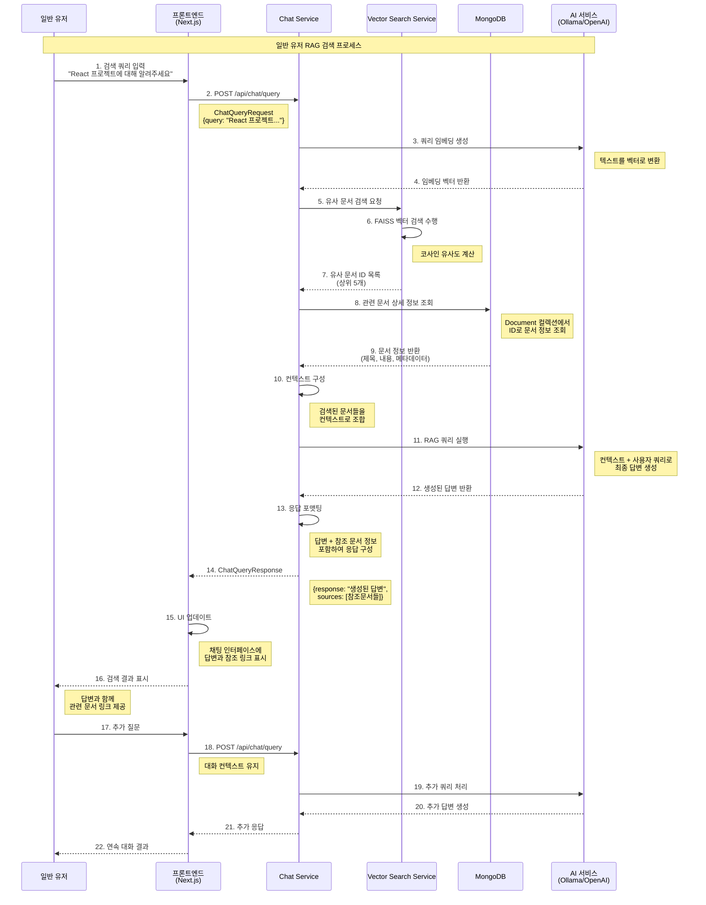
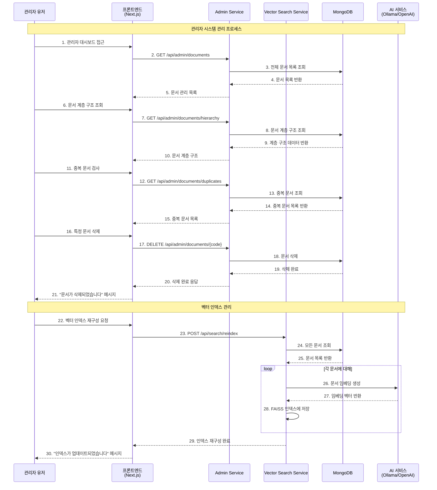

# RAG 검색 시퀀스 다이어그램

## 일반 유저 - RAG 검색 시퀀스 다이어그램

```mermaid
sequenceDiagram
    participant U as 일반 유저
    participant F as 프론트엔드<br/>(Next.js)
    participant CS as Chat Service
    participant VSS as Vector Search Service
    participant M as MongoDB
    participant AI as AI 서비스<br/>(Ollama/OpenAI)

    Note over U,AI: 일반 유저 RAG 검색 프로세스

    U->>F: 1. 검색 쿼리 입력<br/>"React 프로젝트에 대해 알려주세요"
    F->>CS: 2. POST /api/chat/query
    Note right of F: ChatQueryRequest<br/>{query: "React 프로젝트..."}

    CS->>AI: 3. 쿼리 임베딩 생성
    Note right of AI: 텍스트를 벡터로 변환
    AI-->>CS: 4. 임베딩 벡터 반환

    CS->>VSS: 5. 유사 문서 검색 요청
    VSS->>VSS: 6. FAISS 벡터 검색 수행
    Note right of VSS: 코사인 유사도 계산
    VSS-->>CS: 7. 유사 문서 ID 목록<br/>(상위 5개)

    CS->>M: 8. 관련 문서 상세 정보 조회
    Note right of M: Document 컬렉션에서<br/>ID로 문서 정보 조회
    M-->>CS: 9. 문서 정보 반환<br/>(제목, 내용, 메타데이터)

    CS->>CS: 10. 컨텍스트 구성
    Note right of CS: 검색된 문서들을<br/>컨텍스트로 조합

    CS->>AI: 11. RAG 쿼리 실행
    Note right of AI: 컨텍스트 + 사용자 쿼리로<br/>최종 답변 생성
    AI-->>CS: 12. 생성된 답변 반환

    CS->>CS: 13. 응답 포맷팅
    Note right of CS: 답변 + 참조 문서 정보<br/>포함하여 응답 구성

    CS-->>F: 14. ChatQueryResponse
    Note right of CS: {response: "생성된 답변",<br/>sources: [참조문서들]}

    F->>F: 15. UI 업데이트
    Note right of F: 채팅 인터페이스에<br/>답변과 참조 링크 표시

    F-->>U: 16. 검색 결과 표시
    Note right of U: 답변과 함께<br/>관련 문서 링크 제공

    U->>F: 17. 추가 질문
    F->>CS: 18. POST /api/chat/query
    Note right of F: 대화 컨텍스트 유지
    CS->>AI: 19. 추가 쿼리 처리
    AI-->>CS: 20. 추가 답변 생성
    CS-->>F: 21. 추가 응답
    F-->>U: 22. 연속 대화 결과
```

## 관리자 유저 - 시스템 관리 시퀀스 다이어그램

```mermaid
sequenceDiagram
    participant A as 관리자 유저
    participant F as 프론트엔드<br/>(Next.js)
    participant AS as Admin Service
    participant VSS as Vector Search Service
    participant M as MongoDB
    participant AI as AI 서비스<br/>(Ollama/OpenAI)

    Note over A,AI: 관리자 시스템 관리 프로세스

    A->>F: 1. 관리자 대시보드 접근
    F->>AS: 2. GET /api/admin/documents
    AS->>M: 3. 전체 문서 목록 조회
    M-->>AS: 4. 문서 목록 반환
    AS-->>F: 5. 문서 관리 목록

    A->>F: 6. 문서 계층 구조 조회
    F->>AS: 7. GET /api/admin/documents/hierarchy
    AS->>M: 8. 문서 계층 구조 조회
    M-->>AS: 9. 계층 구조 데이터 반환
    AS-->>F: 10. 문서 계층 구조

    A->>F: 11. 중복 문서 검사
    F->>AS: 12. GET /api/admin/documents/duplicates
    AS->>M: 13. 중복 문서 조회
    M-->>AS: 14. 중복 문서 목록 반환
    AS-->>F: 15. 중복 문서 목록

    A->>F: 16. 특정 문서 삭제
    F->>AS: 17. DELETE /api/admin/documents/{code}
    AS->>M: 18. 문서 삭제
    M-->>AS: 19. 삭제 완료
    AS-->>F: 20. 삭제 완료 응답
    F-->>A: 21. "문서가 삭제되었습니다" 메시지

    Note over A,AI: 벡터 인덱스 관리

    A->>F: 22. 벡터 인덱스 재구성 요청
    F->>VSS: 23. POST /api/search/reindex
    VSS->>M: 24. 모든 문서 조회
    M-->>VSS: 25. 문서 목록 반환

    loop 각 문서에 대해
        VSS->>AI: 26. 문서 임베딩 생성
        AI-->>VSS: 27. 임베딩 벡터 반환
        VSS->>VSS: 28. FAISS 인덱스에 저장
    end

    VSS-->>F: 29. 인덱스 재구성 완료
    F-->>A: 30. "인덱스가 업데이트되었습니다" 메시지
```

